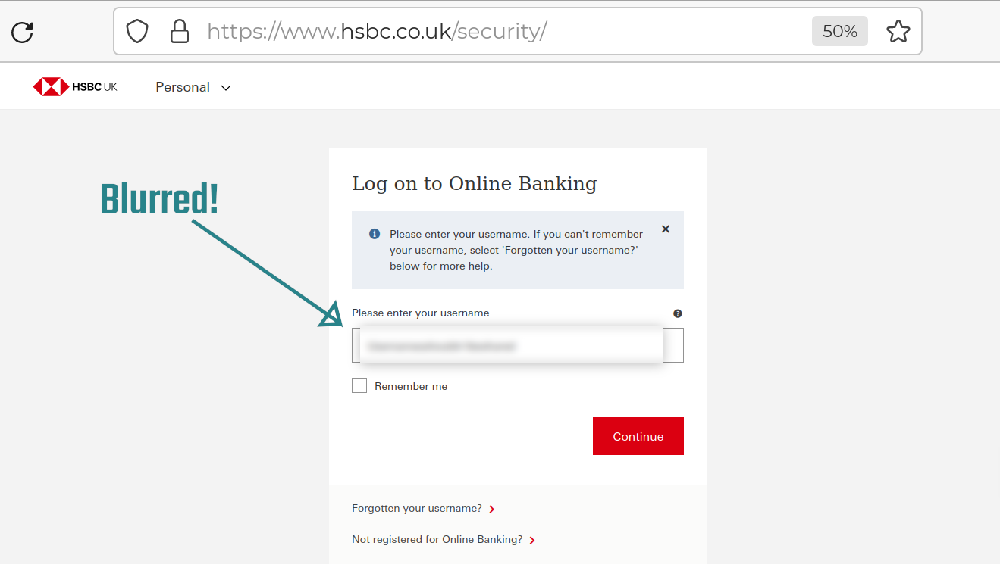

# blur_box
*WARNING* 'just run this code that captures your screen, to cover your super-secure information'.  The security implications of this should fill you with fear!  Please do not use this code unless you can read python and have checked the code doesn't do anything bad!  Even then, I can't vouch for the libraries used (pyscreenshot, etc) so there could be security vulnerabilities.  Honestly, people who publish code like this!  On the other hand, if you know what you are doing, this is some code that I used as a quick way to hide some info in a screen video. Hope it helps...

<p align="center">
   
</p>
A *simple* blurred window to hide URIs, usernames etc while recording video or screencasting. Note the blurred
screen does not update automatically, right-click and select "Reload" to refresh - N.B. the screen is displayed
momentarily if you do this.  With left-click 'Blur box' can be dragged around or if set to 'quick kill' mode this will remove the box.

```
options:
  -h, --help       show this help message and exit
  --x X            X coordinate (default: 0)
  --y Y            Y coordinate (default: 0)
  --width WIDTH    Width (default: 500)
  --height HEIGHT  Height (default: 80)
  -k               Quick kill mode - (window closes on click)
```

example usage:

```python blur_box.py --x 10 --y 20 --width 500 --height 100```

Creates a blur box at x=10, y=20, of size 500x100
